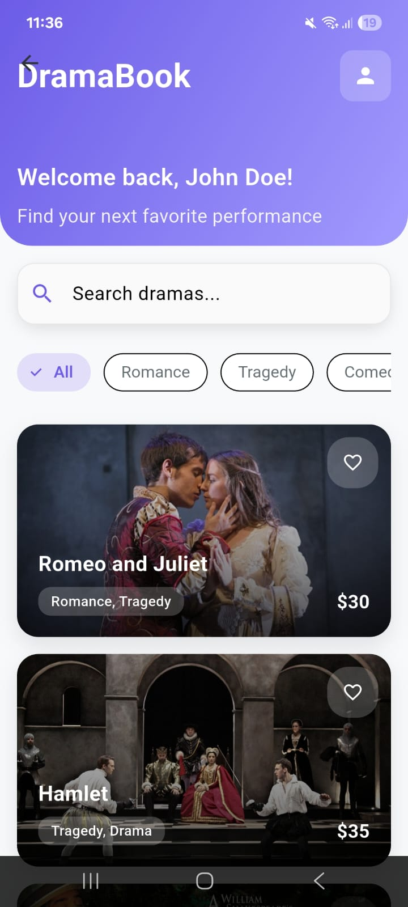
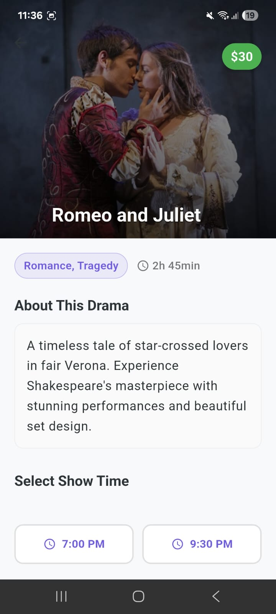
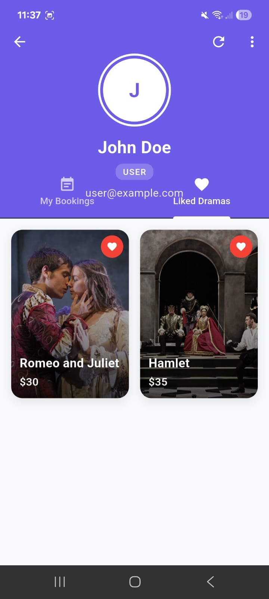
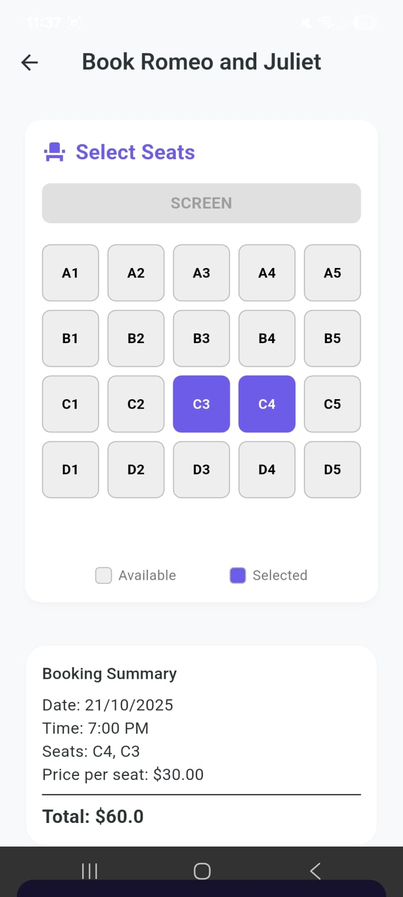
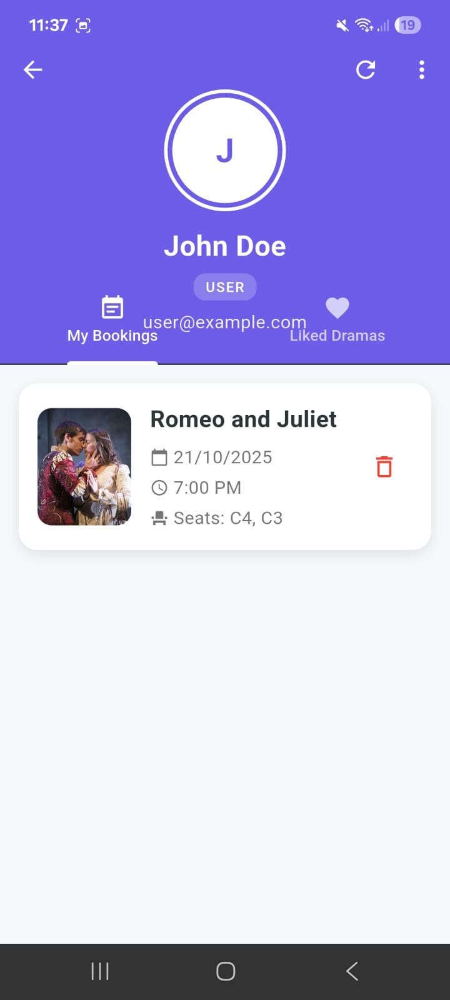
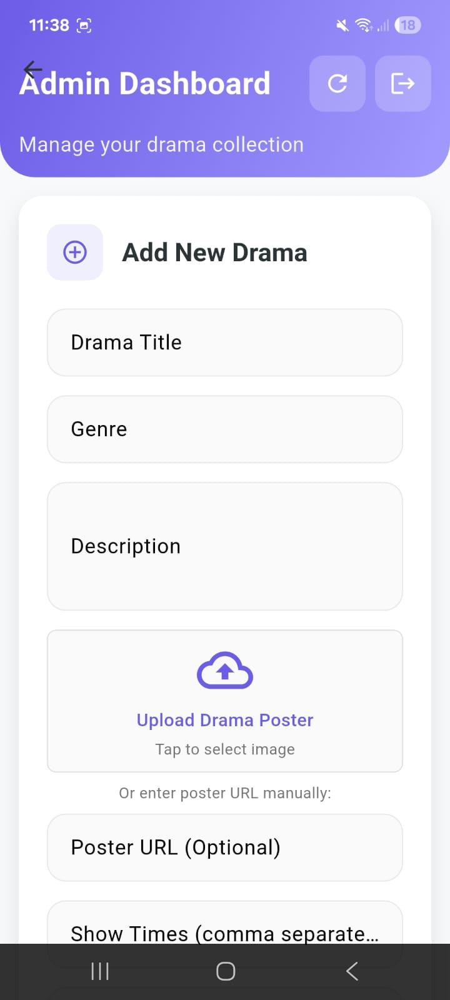
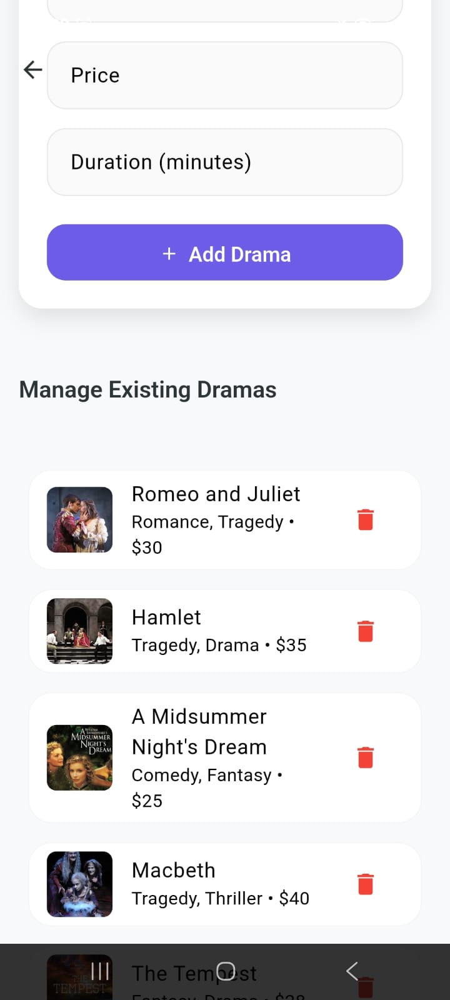

# DramaBook Demo App

A fully functional drama booking Flutter app with local database

## 🎭 Features

- **Local SQLite Database**: All data is stored locally on the device
- **User Authentication**: Login with demo credentials
- **Admin Dashboard**: Add, edit, and delete dramas (admin only)
- **Drama Booking**: Select seats and book dramas
- **User Profile**: View and manage bookings
- **Responsive UI**: Beautiful Material Design interface

### Screens

